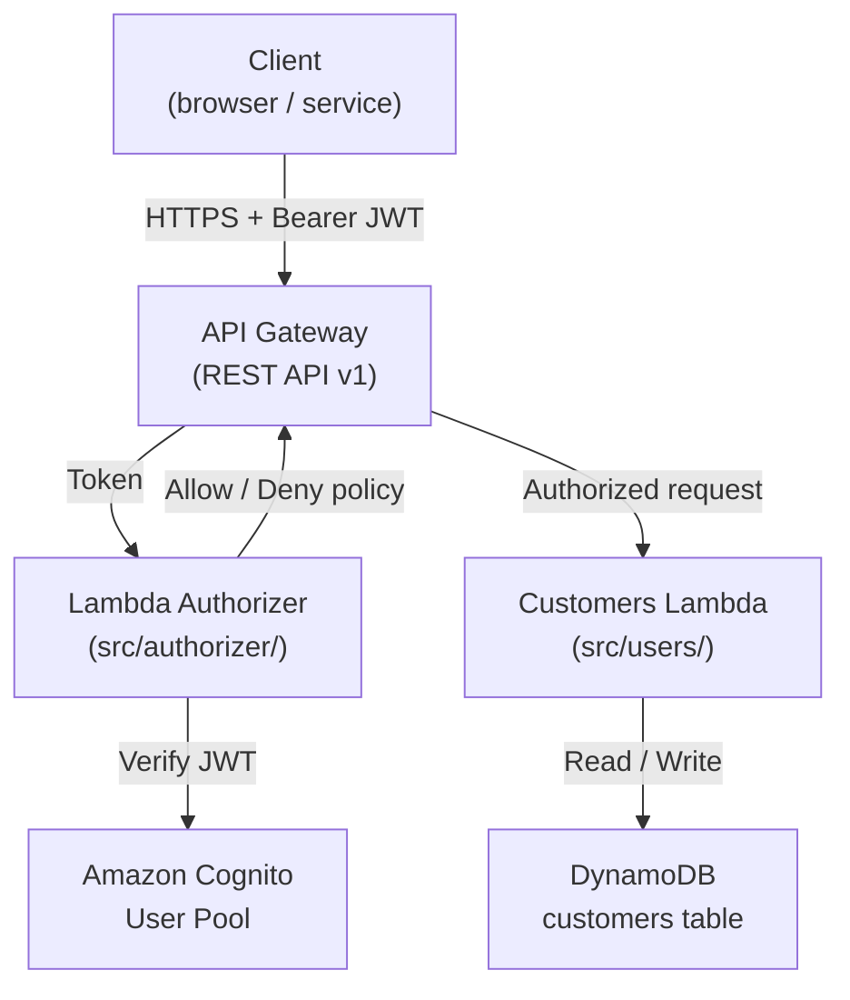

# Serverless Customer Platform — Design

## Overview

This document describes the technical design for RACSOCE's MVP serverless customer management platform. The system exposes a REST API backed by AWS Lambda and API Gateway, with Cognito-based authentication enforced by a Lambda Authorizer. Customer records are stored in DynamoDB. All infrastructure is managed with Terraform.

The design follows the RACSOCE REST API Style Guide: plural-noun resource paths, snake_case field names, consistent JSON envelope shapes, and standard HTTP status codes.

### Goals

- Provide secure, authenticated CRUD operations for customer records
- Keep operational overhead low via fully serverless compute and managed storage
- Establish a clean foundation that can be extended (search, audit logging, multi-tenancy) in future iterations

### Non-Goals (MVP)

- Advanced search and filtering
- Audit logging and change history
- Multi-tenancy

---

## Architecture



**Request flow:**

1. Client sends an HTTPS request with a Cognito-issued JWT in the `Authorization: Bearer <token>` header.
2. API Gateway invokes the Lambda Authorizer for every request.
3. The authorizer verifies the JWT signature and expiry against the Cognito JWKS endpoint, then returns an IAM policy (`Allow` or `Deny`).
4. On `Allow`, API Gateway forwards the request to the Customers Lambda.
5. The Customers Lambda performs the requested CRUD operation against DynamoDB and returns a JSON response.

---

## Components and Interfaces

### 1. Lambda Authorizer (`src/authorizer/lambda_function.py`)

**Trigger:** API Gateway TOKEN authorizer  
**Input:** `{ "authorizationToken": "Bearer <jwt>", "methodArn": "..." }`  
**Output:** IAM policy document with `principalId` and `Allow`/`Deny` effect

Responsibilities:
- Extract the JWT from the `Authorization` header
- Fetch and cache the Cognito JWKS public keys
- Verify the JWT signature, expiry (`exp`), and audience (`aud`) claims
- Return an `Allow` policy on success; `Deny` or raise `Unauthorized` on failure
- Propagate `sub` (Cognito user ID) as a context variable for downstream use

Dependencies: `boto3`, `python-jose`, `datetime`

### 2. Customers Lambda (`src/users/lambda_function.py`)

**Trigger:** API Gateway proxy integration  
**Input:** API Gateway proxy event (`httpMethod`, `pathParameters`, `body`, `requestContext`)  
**Output:** `{ "statusCode": int, "headers": {...}, "body": "<json string>" }`

Responsibilities:
- Route requests by `httpMethod` and `pathParameters`
- Validate and parse request bodies
- Execute DynamoDB operations
- Return responses conforming to the RACSOCE API style guide envelope

Routes:

| Method | Path | Operation |
|--------|------|-----------|
| GET | `/v1/customers` | List all customers |
| POST | `/v1/customers` | Create a customer |
| GET | `/v1/customers/{customer_id}` | Get a customer |
| PUT | `/v1/customers/{customer_id}` | Replace a customer |
| DELETE | `/v1/customers/{customer_id}` | Delete a customer |

### 3. API Gateway (REST API)

- Stage: `v1`
- All routes protected by the Lambda Authorizer (TOKEN type, `Authorization` header)
- Lambda proxy integration for all methods
- CORS enabled for browser clients

### 4. DynamoDB — `customers` table

- Partition key: `customer_id` (String, UUID v4)
- No sort key (single-entity access pattern)
- On-demand billing mode (scales to zero for MVP)
- Point-in-time recovery enabled

### 5. Cognito User Pool

- Used solely for issuing and validating JWTs
- App client configured for the API (no hosted UI required for MVP)
- Token validity: access token 1 hour, refresh token 30 days

---

## Data Models

### Customer Record (DynamoDB item)

```json
{
  "customer_id": "c7f3a1b2-...",
  "first_name": "Jane",
  "last_name": "Doe",
  "email": "jane.doe@example.com",
  "phone": "+15551234567",
  "created_at": "2024-01-15T10:30:00Z",
  "updated_at": "2024-01-15T10:30:00Z"
}
```

| Field | Type | Required | Notes |
|-------|------|----------|-------|
| `customer_id` | String (UUID v4) | Yes | Partition key, system-generated |
| `first_name` | String | Yes | 1–100 chars |
| `last_name` | String | Yes | 1–100 chars |
| `email` | String | Yes | Valid email format, unique |
| `phone` | String | No | E.164 format |
| `created_at` | String (ISO 8601) | Yes | Set on creation, immutable |
| `updated_at` | String (ISO 8601) | Yes | Updated on every write |

### API Request Body — Create / Update Customer

```json
{
  "first_name": "Jane",
  "last_name": "Doe",
  "email": "jane.doe@example.com",
  "phone": "+15551234567"
}
```

### API Response — Single Customer

```json
{
  "data": {
    "id": "c7f3a1b2-...",
    "type": "customer",
    "attributes": {
      "first_name": "Jane",
      "last_name": "Doe",
      "email": "jane.doe@example.com",
      "phone": "+15551234567",
      "created_at": "2024-01-15T10:30:00Z",
      "updated_at": "2024-01-15T10:30:00Z"
    }
  }
}
```

### API Response — Customer Collection

```json
{
  "data": [
    {
      "id": "c7f3a1b2-...",
      "type": "customer",
      "attributes": { "..." : "..." }
    }
  ],
  "meta": {
    "total": 42
  }
}
```

### Authorizer Context (passed to downstream Lambda)

```json
{
  "principalId": "<cognito-sub>",
  "context": {
    "user_id": "<cognito-sub>"
  }
}
```

---

## Correctness Properties

*A property is a characteristic or behavior that should hold true across all valid executions of a system — essentially, a formal statement about what the system should do. Properties serve as the bridge between human-readable specifications and machine-verifiable correctness guarantees.*

The prework analysis identified the following testable properties from the MVP acceptance criteria. Auth.2 and Auth.3 were consolidated (both test invalid-token rejection with different invalid token types). CRUD.2 and CRUD.3 were consolidated (both test payload validation failure). CRUD.4 is subsumed by Property 2 (the creation round-trip already verifies retrieval). Infrastructure (Terraform, Cognito wiring) is excluded from PBT — snapshot and plan-diff checks are used instead.

### Property 1: Invalid JWT is always rejected

*For any* JWT that is expired, carries an invalid signature, or is structurally malformed, the Lambda Authorizer SHALL return a Deny policy and the API SHALL respond with 401 — regardless of the token's claims or payload content.

**Validates: Requirements — User authentication with Cognito (Auth.2, Auth.3)**

### Property 2: Customer creation round-trip

*For any* valid customer payload containing non-empty `first_name`, `last_name`, and a properly formatted `email`, a POST to `/v1/customers` SHALL return 201 with a `customer_id`, and a subsequent GET on that `customer_id` SHALL return a record whose attributes exactly match the original payload.

**Validates: Requirements — Basic CRUD operations (CRUD.1, CRUD.4)**

### Property 3: Invalid payload is always rejected

*For any* create or update request body that is missing at least one required field (`first_name`, `last_name`, or `email`) or contains a string that does not conform to valid email format, the Customers Lambda SHALL return 400 and SHALL NOT write any record to DynamoDB.

**Validates: Requirements — Basic CRUD operations (CRUD.2, CRUD.3)**

### Property 4: Non-existent customer always returns 404

*For any* UUID that has never been used as a `customer_id` (or has been deleted), a GET to `/v1/customers/{customer_id}` SHALL return 404.

**Validates: Requirements — Basic CRUD operations (CRUD.5)**

### Property 5: Customer update round-trip

*For any* existing customer and any valid replacement payload, a PUT to `/v1/customers/{customer_id}` followed by a GET SHALL return a record whose attributes exactly match the replacement payload, with `updated_at` strictly greater than the original `updated_at`.

**Validates: Requirements — Basic CRUD operations (CRUD.6)**

### Property 6: Deleted customer is not retrievable

*For any* existing customer, after a successful DELETE (204) the system SHALL return 404 for every subsequent GET on the same `customer_id`.

**Validates: Requirements — Basic CRUD operations (CRUD.7)**

### Property 7: Every success response conforms to the RACSOCE envelope

*For any* successful API operation, the response body SHALL contain a `data` key whose value is either an object with `id`, `type`, and `attributes` fields (single resource) or an array of such objects (collection), with all date fields in ISO 8601 format and all field names in snake_case.

**Validates: Requirements — REST API endpoints (API.1)**

---

## Error Handling

All error responses follow the RACSOCE error envelope:

```json
{
  "error": {
    "code": "<error_code>",
    "message": "<human-readable message>",
    "request_id": "<api-gateway-request-id>"
  }
}
```

### Error Mapping

| Scenario | HTTP Status | `code` |
|----------|-------------|--------|
| Missing / invalid JWT | 401 | `authentication_failed` |
| Valid JWT, insufficient scope | 403 | `permission_denied` |
| Customer not found | 404 | `resource_not_found` |
| Missing required field | 400 | `validation_failed` |
| Invalid email format | 400 | `validation_failed` |
| Malformed JSON body | 400 | `invalid_request` |
| DynamoDB / internal error | 500 | `internal_error` |

### Lambda Error Handling Strategy

- All Lambda handlers wrap the top-level logic in a `try/except` block.
- `ClientError` from boto3 is caught and mapped to appropriate HTTP status codes.
- Unhandled exceptions are caught, logged (CloudWatch Logs), and returned as 500 with a generic message — internal details are never exposed to callers.
- The authorizer raises `Exception("Unauthorized")` (the API Gateway convention) for invalid tokens, which triggers a 401 response.

---

## Testing Strategy

### Unit Tests (`tests/unit/`)

Focus on pure logic that can be tested without AWS infrastructure:

- **Authorizer:** JWT validation logic — valid token returns Allow policy; expired/invalid tokens return Deny; malformed tokens raise Unauthorized.
- **Customers Lambda:** Request routing, input validation, DynamoDB response mapping, error envelope construction. Use `moto` or `unittest.mock` to mock DynamoDB calls.
- **Test events:** Store representative API Gateway proxy event JSON files under `tests/unit/events/` for use as fixtures.

Run with: `pytest tests/unit/`

### Integration Tests (`tests/integration/`)

Verify end-to-end behavior against a deployed (dev) environment:

- Authenticate against Cognito to obtain a real JWT.
- Exercise each CRUD endpoint and assert HTTP status codes and response shapes.
- Verify that unauthenticated requests receive 401.
- Verify that a deleted customer returns 404 on subsequent GET.

Run with: `pytest tests/integration/`

### Property-Based Tests

Use `hypothesis` (Python) to drive the correctness properties defined above. Each property test is configured with `@settings(max_examples=100)` and tagged with a comment referencing the design property.

Tag format: `# Feature: serverless-customer-platform, Property <N>: <property_text>`

| Property | Test description | Generators |
|----------|-----------------|------------|
| **P1 — Invalid JWT rejection** | Generate expired JWTs (past `exp`), JWTs signed with a wrong key, and structurally malformed strings; assert authorizer returns Deny / 401 for all | `hypothesis.strategies.text()` for malformed; custom strategy for expired/wrong-key JWTs |
| **P2 — Creation round-trip** | Generate random valid customer payloads; POST; GET by returned ID; assert attribute equality | `st.text(min_size=1)` for names, `st.emails()` for email |
| **P3 — Invalid payload rejection** | Generate payloads with one or more required fields removed, or with non-email strings in the `email` field; assert 400 and no DynamoDB write (verified via mock) | `st.fixed_dictionaries` with optional field removal |
| **P4 — Non-existent 404** | Generate random UUIDs not in the database; GET; assert 404 | `st.uuids()` |
| **P5 — Update round-trip** | Create a customer; generate a replacement payload; PUT; GET; assert attributes match replacement and `updated_at` increased | Same generators as P2 |
| **P6 — Delete then 404** | Create a customer; DELETE; GET; assert 404 | Same generators as P2 |
| **P7 — Envelope conformance** | For any successful operation, assert response body has `data` key with correct structure, ISO 8601 dates, snake_case fields | Derived from P2/P5 test runs |

Each property test runs a minimum of 100 iterations.

### Infrastructure Tests

Terraform configuration is validated with:

- `terraform validate` — syntax and schema correctness
- `terraform plan` — dry-run against dev environment
- Snapshot / plan-diff checks in CI to catch unintended resource changes

No property-based tests are written for IaC; snapshot and policy checks are the appropriate tool.
